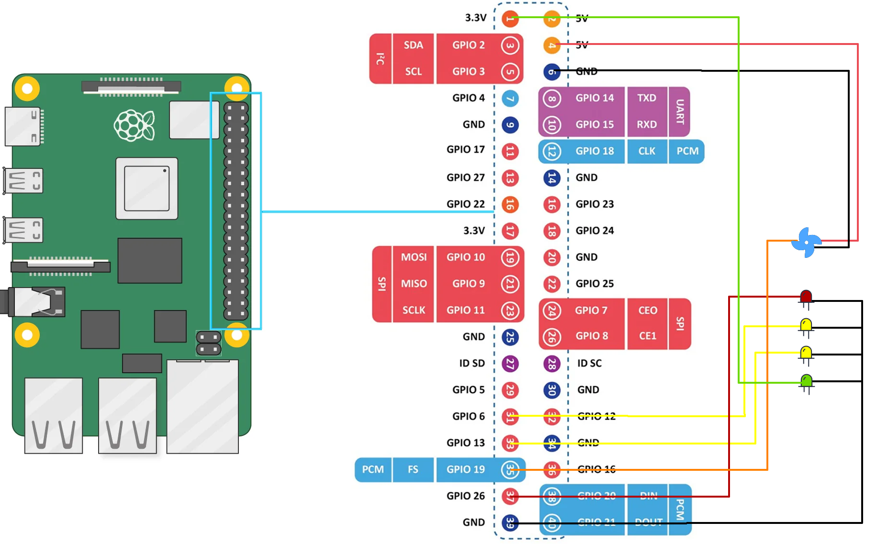

# Raspberry Pi - System Monitor

"System Monitor" is a Python daemon that was built to monitor system health and connectivity, that includes managing and control a PWM fan and system resources such as memory, cpu, disk usage or network connectivity. 

Its main purpose is to provide visual indicators, via external LED's, that indicate  system status. This is specially valuable for Raspberry Pi enclosures such as the  UM-SBC-209 from Racknex ([here](https://racknex.com/raspberry-pi-rackmount-kit-4x-slot-19-inch-um-sbc-209/)):


The software runs as a background process, consistently monitoring system resources and displaying LED status accordingly:


## Requirements

- <u>Hardware</u>
  - Raspberry PI 5 or Raspberry PI 3
- <u>Software</u>
  - Debian 12 (bookworm)
  - Python 3.11.2

## Installation

Installation is done on the 2 components, hardware and software, please check accordingly:

### Hardware

The following diagram illustrates GPIO connection on the Raspberry PI per device type.



### Software:

- #### Setup host boot configs:

  - Setup your Raspberry PI boot configuration accordingly. Open and edit `/boot/firmware/config.txt` :

    1. For the proper PWM reading, make sure the channel is enabled as a PWM emitter, `config.txt` should contain: 

       ```
       dtoverlay=pwm-2chan
       gpio=12=op,dl
       ```

- #### Install package and env:

  - Enter as root:

    ```
    sudo -i
    cd /usr/local/bin/
    ```
  
  - Clone repo:
  
    ```
    git clone https://github.com/jcv-pt/raspberry-pi-system-monitor.git
    cd raspberry-pi-fan-controller
    ```
  
  - Create a new venv:
  
    ```
    python -m venv ./system-monitor-venv
    source ./system-monitor-venv/bin/activate
    ```
  
  - Current release was run on Python 3.11.2 version. 
  
    Use the package manager [pip](https://pip.pypa.io/en/stable/) to install "System Monitor" required libs depending on the Raspberry-pi model:
  
    - For Raspberry-pi version 3:
  
      ```
      pip install -r requirements-pi3.txt
      ```
  
    - For Raspberry-pi version 5:
  
      ```
      pip install -r requirements-pi5.txt
      ```
  


- #### Initialize and setup configurations:

  - Copy & edit the config sample file located at:

    ```
    cp data/config/sample.default.ini data/config/default.ini
    ```

  - Modify this file according to the GPIO, hardware connected and metrics, here is a full list of the configuration options available:

    - `[Connectivity][Hosts]`
      
      - <u>Desc</u>: *The hosts on which ping request will be made against in order to verify network conectivity; "gateway" stands for whatever interface gateway is configured(eg: router)*
      - <u>Default</u>: `gateway,google.pt`
      
    - `[CPU][WarningPercentage]`
      
      - <u>Desc</u>: *The min warning threhold for the system to report an issue with the CPU;*
      - <u>Default</u>: `95`
      
    - `[Disks][Devices]`
      
      - <u>Desc</u>: *The device paths to perform disks tests; These are separated by "," (comma);*
      - <u>Default</u>: `/`
      
    - `[Disks][WarningPercentage]`
      
      - <u>Desc</u>: *The min warning threhold for the system to report an issue with the Disks, in this case warnings will be raised if space ocupied > 85%;*
      - <u>Default</u>: `85`
      
    - `[Fan][ShutdownGraceTime]`
      
      - <u>Desc</u>: *In minutes, time after temperature reaches MinTemp on which the fans will stop;*
      - <u>Default</u>: `1`
      
    - `[Fan][RotationProfile]`
      
      - <u>Desc</u>: *Fan rotation profile to be applied per temperature; JSON Format;*
      
      - <u>Default</u>: 
      
        ```
        [
            {"from":0,"to":40,"rotation":0},
            {"from":40,"to":45,"rotation":25},
            {"from":45,"to":50,"rotation":55},
            {"from":50,"to":60,"rotation":65},
            {"from":60,"to":150,"rotation":100}]
        ```
      
        **Note**: make sure indentation follows the above example otherwise .ini parsing will fail;
      
    - `[PWM][Channel]`
      
      - <u>Desc</u>: *PWM Channel for the fan rotation (check HardwarePWM lib);*
      - <u>Default</u>: `0`
      
    - `[PWM][ChipNo]`
      
      - <u>Desc</u>: *Chip No (check HardwarePWM lib);*
      - <u>Default</u>: `0`
      
    - `[PWM][Frequency]`
      
      - <u>Desc</u>: *Pwm Frequency (check HardwarePWM lib);*
      - <u>Default</u>: `25_000`
      
    - `[Indicators][GPIORunning]`
      
      - <u>Desc</u>: *GPIO port of the running indicator (LED)*;
      - <u>Default</u>: `1`
      
    - `[Indicators][GPIOConnectivity]`
      
      - <u>Desc</u>: *GPIO port of the network connectivity indicator (LED);*
      - <u>Default</u>: `31`
      
    - `[Indicators][GPIOAlert]`
      
      - <u>Desc</u>:GPIO port of the alert (LED);
      - <u>Default</u>: `33`
      
    - `[Indicators][AlertMode]`
      
      - <u>Desc</u>: *Alert signal mode for the GPIOAlert ( "flash" or "static" )*;
      - <u>Default</u>: `flash`
      
    - `[Logs][MaxLogLines]`
      - <u>Desc</u>: *Max number of lines per log, once reached log is rotated;*
      - <u>Default</u>: `2000`
      
    - `[Logs][MaxFilesCount]`
      - <u>Desc</u>: *Number of rotated logs to keep*;
      - <u>Default</u>: `3`

- #### Install as a service:

  - In order to install "System Monitor" as a debian service, please follow steps bellow:
  
    1. Create a service file, e.g., `/etc/systemd/system/raspberry-system-monitor.service`:
  
       ```
       [Unit]
       Description=Raspberry System Monitor
       After=syslog.target network.target
       
       [Service]
       WorkingDirectory=/usr/local/bin/raspberry-system-monitor
       ExecStart=/usr/local/bin/raspberry-system-monitor/system-monitor-venv/bin/python /usr/local/bin/raspberry-sytem-monitor/system-monitor --verbose=0 --debug=0
       Restart=always
       
       [Install]
       WantedBy=multi-user.target
       ```
  
    2. Reload service list:
  
       ```
       systemctl daemon-reload
       ```
  
    3. Enable and start the service:
  
       ```
       sudo systemctl enable raspberry-system-monitor.service
       sudo systemctl start raspberry-system-monitor.service
       ```
  
    4. Monitor output with:
  
       ```
       journalctl -S today -u raspberry-system-monitor.service
       ```

## Usage

### How to run:

"System Monitor" can be run with:

```sh
python system-monitor
```

#### Available arguments:

| Flag       | Description                                                  | Accepted Values |
| ---------- | ------------------------------------------------------------ | --------------- |
| -h, --help | Shows help screen with all available arguments               | --              |
| --verbose  | Weather to display logging output                            | 0,1             |
| --debug    | Weather to display debug data to output                      | 0,1             |
| --report   | Print system report to console                               | --              |
| --test     | Starts the test sequence for the leds or fans. Helpful for troubleshoot; | 'leds' or 'fan' |

## Operation

### LED Mapping

"System Monitor" LED mapping here described from top to bottom:

| LED Status | Description                                                  |
| ---------- | ------------------------------------------------------------ |
| First LED  | Alert LED; Indicator that turns ON when there are any issues with CPU, DISKS or NETWORK; |
| Second LED | Network Connectivity LED; Indicator that turns ON when the system has network connectivity; |
| Third LED  | Running LED; Indicator that turns ON when the "System Monitor" daemon is running; |
| Forth LED  | Device Power LED; Indicator that is always ON as long as the device has power; |

### LED Status

"System Monitor" will display status on each individual LED's:

| LED Status           | Description                                                  |
| -------------------- | ------------------------------------------------------------ |
| Continuous on red    | Status NOT OK, there is a system warning, please check logs; |
| Continuous on yellow | Status is OK;                                                |
| Continuous flashing  | Fault / issue indication,  check **Fault / Issue List** section; |

## Troubleshooting

In order to diagnose faults, please inspect the logs under `<root>/data/logs/`;

### Fault / Issue List

Here is a list of possible faults:

| Possible Faults                      | Description                                                  | Likely Cause                             |
| ------------------------------------ | ------------------------------------------------------------ | ---------------------------------------- |
| ALL LED's are off                    | No power to the LED's;                                       | Device has no power or its disconnected; |
| OS / Engine related software issues; | All other sorts of exceptions unforseen due to OS events or Engine code; | None to be foreseen, check logs;         |


## License

[MIT](https://choosealicense.com/licenses/mit/)